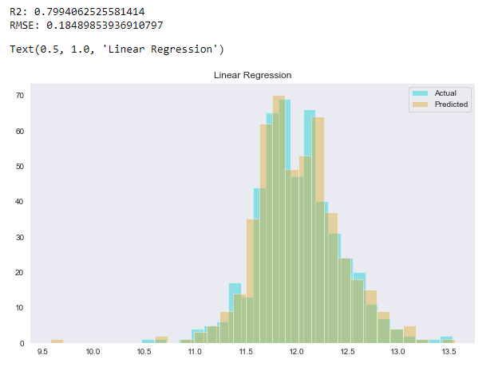
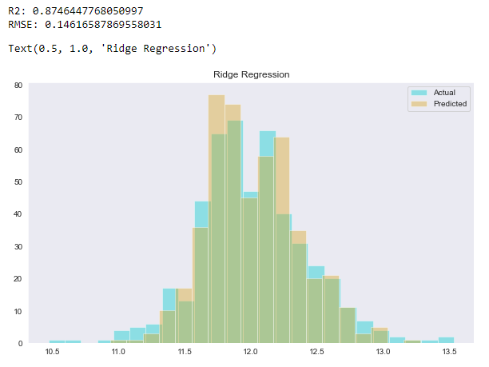
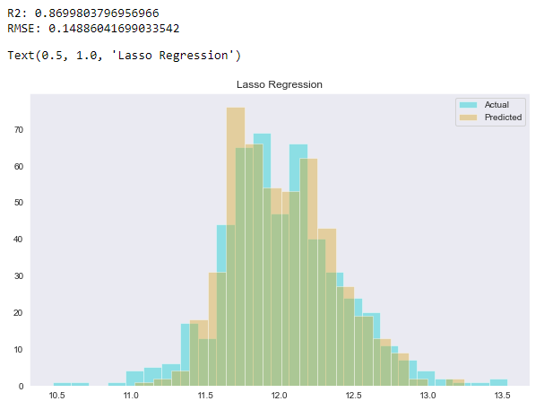
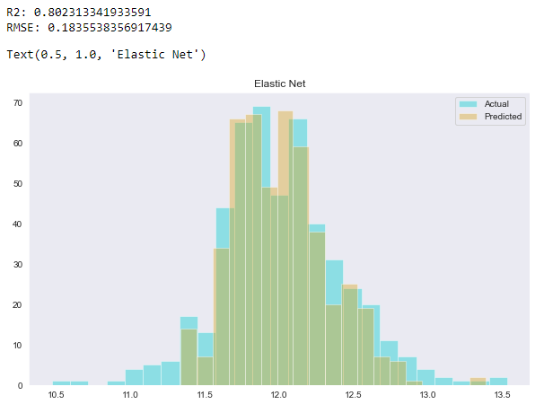

# HousePrices
En este proyecto vamos a analizar los factores relacionados con los precios de las casas para predecir este último utilizando regresión lineal, ridge, lasso y elastic net. Utilizando cross validation encontraremos los hyperparámetros óptimos para los modelos y compararemos entre ellos utilizando como medidas de bondad de ajuste R^2 y RMSE.

## Datos
Antes de ajustar los modelos revisamos los datos por separado en el trainset y testset, reemplazando valores faltantes por una categoría adecuada de acuerdo con la descripción de los datos (data_description.txt) si es posible. En algunos predictores reemplazamos NA con None para indicar la falta de esa característica en la propiedad (e.g. Alley), mientras que en otros reemplazamos NA por 0 para indicar falta de área, baños, etc (por ejemplo GarageArea). 

##  Correlación y visualización
Ya que no hay datos faltantes, exploramos la relación entre las variables. Aquí transformamos la variable respuesta para corregir su escala y el sesgo, calculamos la matriz de correlación y visualizamos gráficamente los predictores más correlacionados con logSalePrice.

## Codificación de variables ordinales y  categóricas
Separamos las variables categóricas en dos grupos: las ordinales y las puramente categóricas. Las ordinales son aquellas que consideramos que pueden tener un orden e.g. para predictores que tienen que ver con calidad y tienen valores 'Ex(excellent)', 'Gd(good)' etc. Estas las codificamos mediante labelEncoding y para las sobrantes utilizamos one-hot encoding. 

## Resultados
<ul>
  <li>Regresión lineal </li>
      
  <li>Ridge</li>
  
  
 con alpha = 0.698.
  <li>Lasso</li>
  
  
 con alpha = 0.0005.
  <li>Elastic Net</li>
  
  
 con alpha = 2.328 y lambda = 0.5.
</ul>
Elegimos como mejor modelo con respecto a R^2 y el error cuadrático medio a la regresión Ridge.
